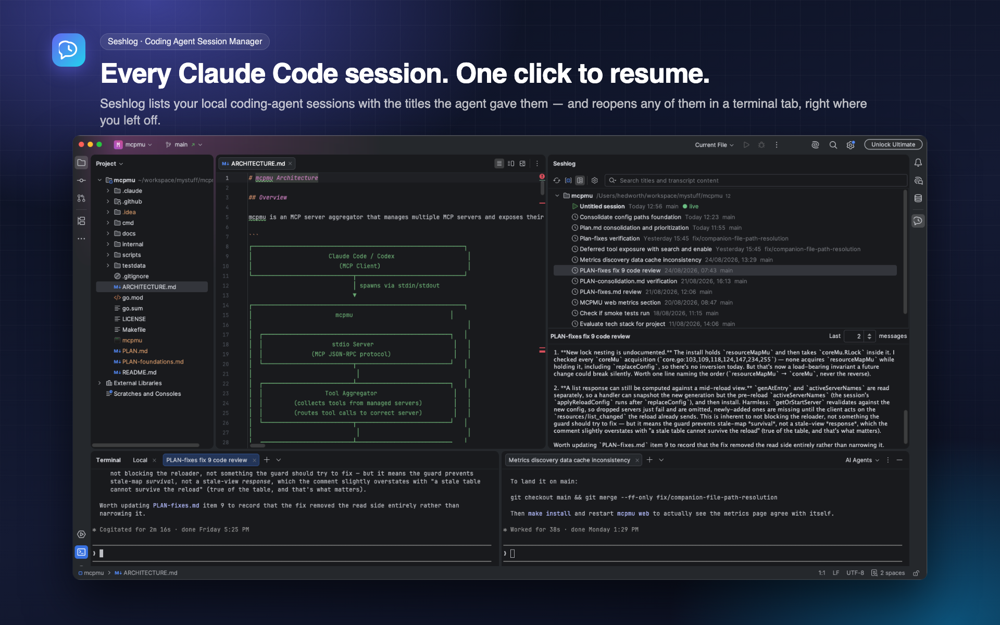
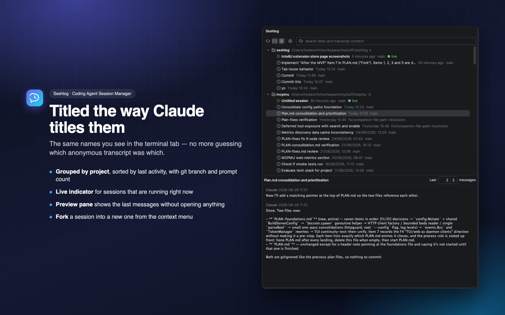
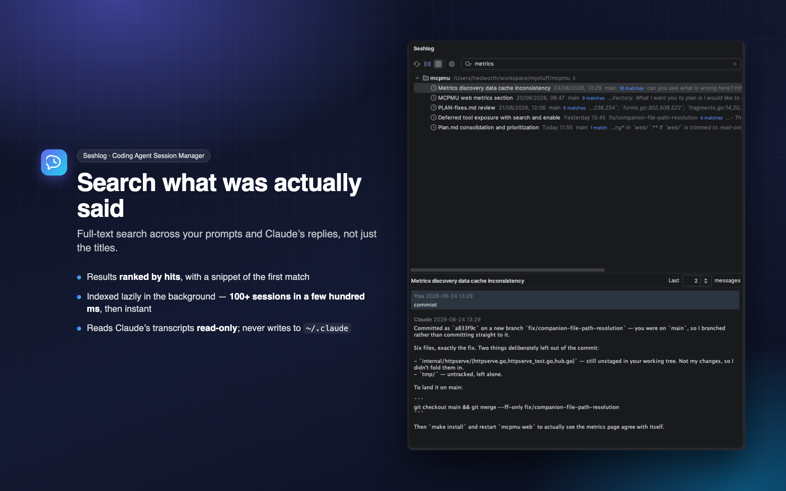
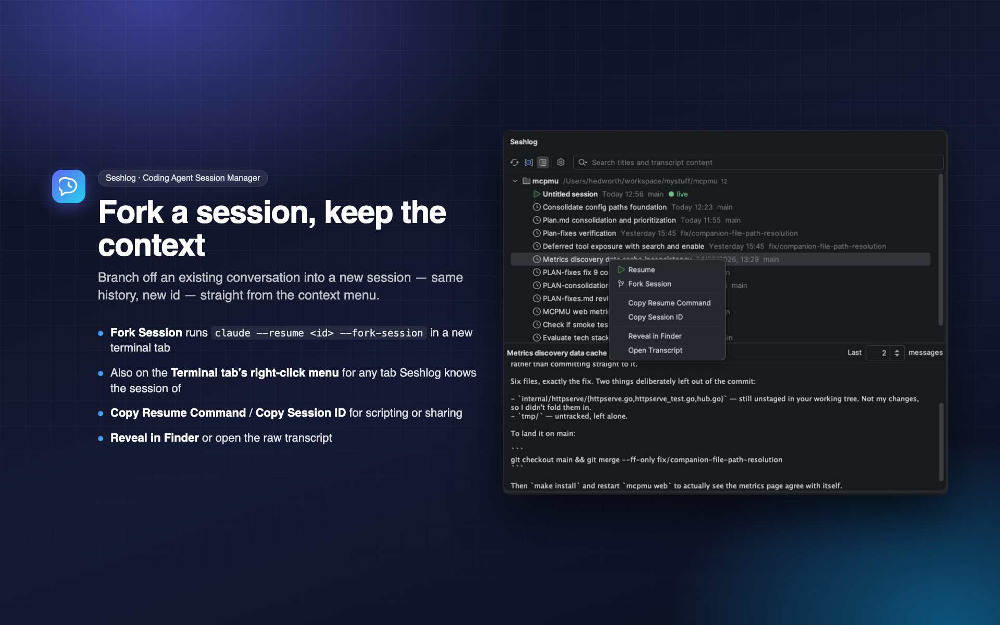

# Seshlog

https://plugins.jetbrains.com/plugin/33850-seshlog--coding-agent-session-manager

An IntelliJ plugin that lists your local Claude Code, Codex, opencode and Pi sessions, titled the way
the agent titled them, with one click to resume any of them in a terminal tab.

Restarting your IDE closes every terminal tab, and with them your running coding-agent sessions.
Getting back to one means remembering which project it was in and finding it in the agent's session
picker. Seshlog makes it a click.



## Features

- **Sessions grouped by project**, sorted by last activity, with the agent's own title, git branch,
  prompt count, and a live indicator for sessions running right now.
- **Agents menu** lets you show any combination, such as Claude Code and Codex together.
  Auto defaults to the provider with the most sessions; All selects every agent. The menu only lists agents with sessions in the current project scope. Choices are remembered per project.
- **Flexible search** across provider titles, local names, project paths and conversation text.
  Words match in any order, including across messages; use `"quoted phrases"` for contiguous text.
  Title and phrase matches rank first, with recency breaking ties and snippets opening in the viewer.
- **Date filter** for All time, Today, Last 7/30 days or a custom inclusive calendar range,
  using last activity in your system time zone. It applies to browsing and search and resets with the panel.
- **Conversation viewer** with term highlighting and previous/next match navigation.
  Claude Code, Codex and opencode tool names, inputs and textual results are searchable too.
  Tool entries start collapsed; navigating to a match expands its entry. Use Expand/collapse tool
  on the entry at the caret to inspect or fold it. Previews and prompt counts remain dialogue-only.
  Images, binary payloads, thinking and subagents are excluded.
- **Bounded content** shared by search and the viewer: 32,000 characters per entry,
  500,000 characters / 2,000 entries per session. JSON records above 1,000,000 characters are
  skipped and extraction scans at most 16,000,000 source characters. Truncation and partial
  search coverage are shown explicitly; text beyond these limits is not searchable.
- **Copy Message** copies the entry at the viewer caret or current match, including an explicitly
  selected tool entry. **Copy Conversation (dialogue only)** copies loaded user/assistant text with
  role labels, preserving code blocks and blank lines. Ordinary selection copying still works.
  Copy actions are disabled during loading; partial content is reported when limits apply.
- **Pin, rename and hide** sessions locally; Show Hidden lets you restore them.
- **Sibling worktrees** can be included in the project filter. Collapsed groups and selection survive refresh.
- **Missing-directory recovery** lets you choose a working directory when resuming old work.
- **Loading and provider diagnostics** show scan/search progress and offer retry for unreadable storage.
- **Preview pane** showing the last messages of the selected session without opening anything.
- **Active terminal highlight** uses a bold blue title for the session associated with the selected IDE terminal tab,
  independently of the session you select to preview. A selected active title is bold and underlined.
  Switching to an unrecognised tab clears it.
- **Resume or fork** into a terminal tab. If the session is already running in one of this project's
  tabs, Seshlog focuses that tab instead of starting a duplicate.
- **Kill Session** in the session context menu closes its terminal tab in this project, stops its
  processes (including lingering processes from closed tabs), and refreshes the live status and PID.
  Available when Seshlog knows the tab or PID; session transcripts remain available to resume later.
- **Restore after restart** — sessions that were live when the IDE closed are offered for resuming
  when the project reopens (Ask / Always / Never).





## Requirements

- IntelliJ IDEA 2024.1 or newer (any IntelliJ Platform IDE with the bundled Terminal plugin).
- Any of [Claude Code](https://claude.com/claude-code),
  [Codex](https://developers.openai.com/codex/cli/), [opencode](https://opencode.ai) or [Pi](https://pi.dev) installed,
  with the corresponding executable on the PATH of the shell your Terminal tool window uses.
- JDK 17 to build from source.

## Install

Not yet on the JetBrains Marketplace. To build and install it yourself:

```sh
./gradlew buildPlugin
```

then in the IDE: **Settings → Plugins → ⚙ → Install Plugin from Disk…** and pick
`build/distributions/seshlog-<version>.zip`.

Open the tool window with **View → Tool Windows → Seshlog** (it docks on the right).

### Pi sessions

Pi support requires **0.84.2 or newer**. Seshlog reads JSONL files in the sessions directory
and its immediate project subdirectories without migrating or modifying them. Configure a custom
`--session-dir` location under **Tools → Seshlog → Pi sessions directory**; per-project Pi
settings and arbitrary storage locations are not discovered automatically.

Search, preview, prompt counts and fallback titles use the persisted active branch, retaining
original conversation history across compaction. Other branches are not searched, and branch
switches that Pi has not saved cannot be inferred. Only user and assistant text is included;
images, thinking, tools and extension content are omitted. Explicit session names take precedence.
Pi has no live badges or restart recovery. Manual Resume and Fork work through the terminal;
forks are saved beside the source so custom-root sessions remain discoverable.

CLI acceptance was checked offline with [Pi v0.84.2](https://github.com/badlogic/pi-mono/tree/914cf1472e715297caa30db4b9535d534a9eb718)
using disposable synthetic sessions: exact-file resume and a new fork ID with `--session-dir`,
including paths containing spaces and apostrophes.

## Privacy

Seshlog is entirely local. It makes no network requests of any kind — there is no telemetry, no
analytics, and no remote service involved.

It reads the agents' data directories — `$CLAUDE_CONFIG_DIR`/`~/.claude`,
`$CODEX_HOME`/`~/.codex`, Pi’s sessions directory (normally `~/.pi/agent/sessions`)
and `$XDG_DATA_HOME/opencode`/`~/.local/share/opencode` — **read-only** and
never writes to them. opencode's SQLite database is opened read-only, so a session running
alongside is never disturbed — reading it does update `opencode.db-shm`, the shared-memory index
every SQLite reader maintains, which holds no session data of its own. Its own state lives in the IDE's own storage:

- parsed-transcript caches in `<IDE system dir>/seshlog/`, holding per-session metadata
  only — title, cwd, branch, timestamps, prompt count. No message content is written to it: the
  label for an untitled session is reduced to a single line of at most 80 characters at parse time,
  and the raw prompt is never retained. Safe to delete at any time;
- the content search index, which is held in memory only and never written to disk;
- settings in `seshlog.xml`, and the per-project agent filter and restore list in `workspace.xml`.

## Settings

**Settings → Tools → Seshlog**

| Setting | Default | |
| --- | --- | --- |
| Claude data directory | auto | `$CLAUDE_CONFIG_DIR`, else `~/.claude` |
| Claude executable | `claude` | Resolved via the terminal shell's PATH |
| Codex data directory | auto | `$CODEX_HOME`, else `~/.codex` |
| Codex executable | `codex` | Resolved via the terminal shell's PATH |
| Pi sessions directory | auto | `$PI_CODING_AGENT_SESSION_DIR`, else `$PI_CODING_AGENT_DIR/sessions`, else `~/.pi/agent/sessions` |
| Pi executable | `pi` | Pi 0.84.2 or newer; resolved via the terminal shell's PATH |
| opencode data directory | auto | `$XDG_DATA_HOME/opencode`, else `~/.local/share/opencode` |
| opencode executable | `opencode` | Resolved via the terminal shell's PATH |
| Show archived sessions (opencode) | off | Sessions archived inside opencode stay hidden unless on |
| Agents menu | Auto | Show any combination of agents, all agents, or automatically the provider with the most sessions; stored per project |
| Show sessions from all projects | off | Otherwise only sessions whose cwd is under the open project |
| Hide untitled sessions with fewer than *n* prompts | 1 | Filters out aborted starts; 0 shows everything |
| Sessions live at shutdown | Ask | Ask / Always restore / Never restore |
| Preview pane | on, 2 messages | Shown below the session list |

## Development

```sh
make run      # ./gradlew runIde — sandbox IDE with the plugin loaded
make check    # ./gradlew test
make release  # build + verify the plugin zip
```

`./gradlew verifyPlugin` runs the JetBrains Plugin Verifier against the recommended IDE range; CI
runs it on every push.

Both are also worth knowing:

- `SESHLOG_BENCH=1 ./gradlew test --tests '*RealDataScanBenchmark*'` times a scan of your real
  `~/.claude`. It is skipped by default and never runs in CI.
- The plugin targets Kotlin API level 1.9 because platform 2024.1 bundles the Kotlin 1.9 stdlib;
  using a 2.x-only stdlib API is a compile error rather than a runtime failure on older IDEs.

Session reading is deliberately defensive — the agents' storage formats are internal and can change
between versions. In the `.jsonl` transcripts of Claude Code and Codex, unknown record types are
skipped, missing fields become null, and a malformed line is logged at DEBUG and ignored; opencode's
database is queried for the few columns Seshlog needs, and a database it cannot read leaves the
provider empty rather than failing the scan. See `src/test/resources/fixtures/` for the shapes that
are covered — including `opencode_fixture.sql`, the SQL script the tests build a throwaway opencode
database from.

## Roadmap

- **More agents** behind the existing `SessionProvider` seam.
- **Live opencode sessions.** opencode writes no lock or pid file, so its sessions never show as
  running and are not restored after a restart.
- **Titles for the untitled.** Around 7% of sessions never get an `ai-title`; generate one from the
  first exchange and store it on the Seshlog side.
- **Housekeeping.** Delete or archive old transcripts from the UI, and show disk usage per project.

## Contributing

Issues and pull requests are welcome. `make check` should pass, and new parsing behaviour should
come with a fixture in `src/test/resources/fixtures/` — please make sure any fixture you add is
synthetic rather than a real transcript.

## License

[MIT](LICENSE)
